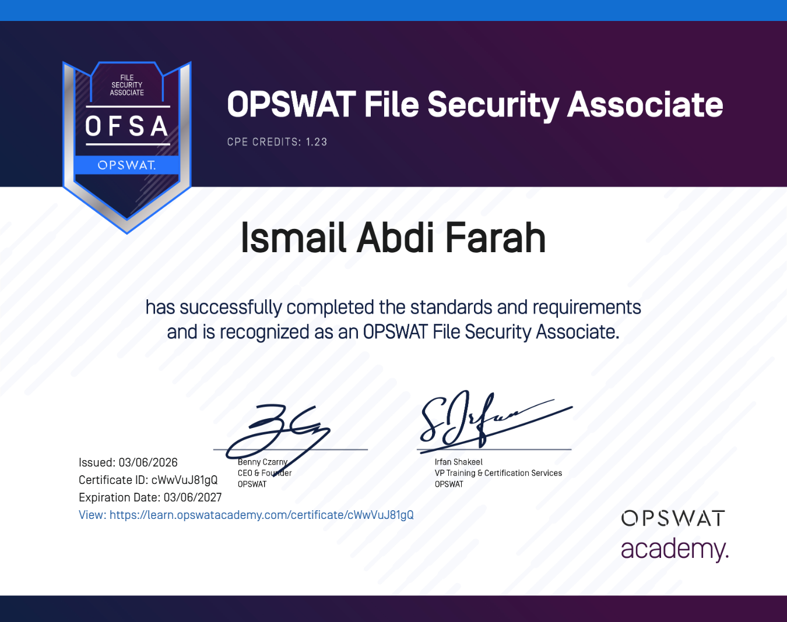

# 🎓 Professional Development & Certifications

This repository tracks my journey in **Cybersecurity** and **Networking**. Each certificate represents a milestone in my technical expertise.

---

## 🛡️ Cybersecurity (OPSWAT Academy)

### 🏅 OPSWAT Cybersecurity Fundamentals Associate (OCFA)
.png)

**Description:** This certification validates a foundational understanding of the cybersecurity landscape and the critical strategies required to protect organizational data.
* **Key Skills:** Understanding threat vectors, the cyberattack lifecycle, and security best practices.

---

### 🏅 OPSWAT File Security Associate (OFSA)

**Description:** Focuses on technical file-based security and mitigating malware within common data formats. 
* **Key Skills:** Mastering **Content Disarm and Reconstruction (CDR)** and secure data workflows.

---

## 🌐 Networking & Infrastructure
### 🏅 Networking Devices and Initial Configuration

**Description:** Foundational knowledge in configuring network devices, switches, and routers using Cisco standards.
